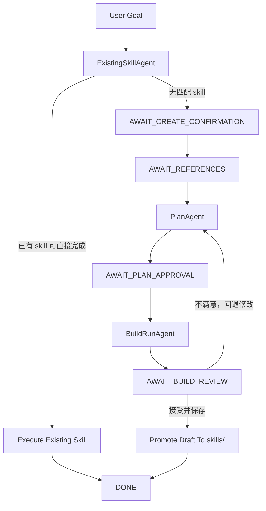

# Skill Creator Agent

`skill-creator-agent` 是一个基于 Ferry/DataAgent 构建的专用子 agent，用来发现、规划、创建、执行并发布本地 skill。

它最初来源于 `workflow-svc` 中的 skill creation 能力迁移，但实现方式不是照搬原服务，而是针对 Ferry 只能一问一答的约束，重构成一套多阶段编排的交互式工作流。

## 项目目标

这个项目解决的是一个很具体的问题：

- 优先复用已有 skill
- 没有合适 skill 时，通过 human-in-loop 方式确认是否创建新 skill
- 结合参考资料和图数据库能力产出自然语言方案
- 自动生成并执行 draft skill
- 用户确认满意后，再正式发布到 `skills/`

它不是一个单纯的脚手架工具，也不是一组独立脚本，而是一个带状态机、router 和多阶段执行能力的 skill creation runtime。

## 核心能力

- 发现本地已有 skill，并判断是否可直接满足用户目标
- 在缺少 skill 时，引导用户进入创建流程，而不是直接盲目生成代码
- 读取参考资料，按业务逻辑生成用户可确认的 `PlanDoc`
- 基于已批准方案构建 draft skill，并在同一阶段内自动执行和修复
- 把 draft skill 与正式 `skills/` 隔离，只有用户接受后才发布
- 支持在 build review 阶段回退到方案修订，而不是直接在错误代码上硬补
- 暴露图数据库相关工具，支持 schema 查询、样例查询、属性过滤等能力

## 为什么基于 Ferry/DataAgent

本项目的核心约束是：需要复用 Ferry core，但 Ferry 本身更适合一问一答，而 `workflow-svc` 原始流程包含明显的 human-in-loop 多轮确认。

因此本项目的设计重点不是“把所有逻辑塞进一个 prompt”，而是：

- 把原本长链路的人机交互拆成几个明确的阶段
- 每个阶段单独 materialize 一份 Ferry 配置
- 每个阶段用一个独立的 `DataAgent` 执行当前回合
- 用代码态 session state 和统一 router 承接多轮状态

换句话说，Ferry 提供的是单阶段执行能力，本项目在其之上补齐了多阶段编排能力。

## 复用了 Ferry/DataAgent 的哪些能力

当前实现直接复用了这些 Ferry 基础能力：

- `DataAgent.from_config(...)`
  - 每个阶段都通过渲染后的 Ferry YAML 初始化一个真实 `DataAgent`
- Ferry 配置渲染
  - 通过 `build_ferry_config(...)` / `materialize_ferry_config(...)` 生成阶段级配置
- `llm_manager`
  - 阶段 agent 和统一 router 都走 Ferry 的模型管理器
- `tool_manager`
  - 本地 skill 工具、图数据库工具、文件工具都按 Ferry 的工具机制暴露
- output/session 管理
  - 每个阶段都有独立 `session_id` 和 `output_path`
- system prompt / constraint / tool allowlist 注入
  - 每个阶段都可以单独设置系统提示词、约束和白名单工具

在当前代码里，这些能力主要落在：

- `src/skill_creator_agent/orchestration/stage_runner.py`
- `src/skill_creator_agent/ferry_integration/config.py`
- `src/skill_creator_agent/ferry_integration/tools.py`
- `src/skill_creator_agent/ferry_integration/runtime_reset.py`

其中有一个实现细节很重要：

- 每次阶段切换前会重置 Ferry 单例缓存，避免工具注册、skills 暴露、LLM cache 在多阶段之间串味

## 整体架构

### 顶层组件

当前架构收敛为 3 个业务 agent 和 2 个支撑组件：

- `ExistingSkillAgent`
- `PlanAgent`
- `BuildRunAgent`
- `UnifiedRouter`
- `DraftSkillManager`

### 执行流



### 顶层状态机

当前 `SessionState` 使用这些状态：

- `IDLE`
- `DISCOVERING`
- `AWAIT_CREATE_CONFIRMATION`
- `AWAIT_REFERENCES`
- `PLANNING`
- `AWAIT_PLAN_APPROVAL`
- `BUILDING_AND_RUNNING`
- `AWAIT_BUILD_REVIEW`
- `DONE`
- `CANCELLED`
- `ERROR`

这些状态定义在：

- `src/skill_creator_agent/orchestration/models.py`

## 各阶段职责

### 1. ExistingSkillAgent

职责：

- 列出当前可用 skill
- 判断现有 skill 是否和用户目标匹配
- 必要时直接执行已有 skill
- 如果没有合适 skill，则进入“是否创建新 skill”的确认阶段

对应代码：

- `src/skill_creator_agent/orchestration/stages/existing_skill.py`

### 2. PlanAgent

职责：

- 读取用户提供的参考资料
- 必要时调用图数据库工具确认实体、字段和输出形态
- 生成用户可确认的自然语言方案文档
- 当用户对 build 结果不满意时，基于反馈重新修订方案

当前 `PlanAgent` 输出的是一份面向用户的 `PlanDoc`，重点是：

- 业务逻辑是否正确
- 所需图数据库实体是否合理
- 执行步骤是否符合预期
- 最终输出格式是否符合预期

它不会对用户暴露内部文件布局、脚本路径或其它实现细节。

对应代码：

- `src/skill_creator_agent/orchestration/stages/plan.py`
- `src/skill_creator_agent/prompts/stage_context_plan_agent.md`

### 3. BuildRunAgent

职责：

- 基于已批准方案创建 draft skill
- 更新 `SKILL.md`
- 写主脚本
- `reload_skill`
- 立刻执行 skill
- 如果运行失败，则在同一阶段内修复并重试
- 产出 build review 摘要和原始问题结果

这个阶段的目标不是“写出文件就结束”，而是：

- 代码真的能跑
- 结果真的回答了原始问题
- 然后再把当前实现交给用户 review

对应代码：

- `src/skill_creator_agent/orchestration/stages/build_run.py`
- `src/skill_creator_agent/prompts/stage_context_build_run.md`

## UnifiedRouter 设计

`UnifiedRouter` 是整个工作流的唯一“路口”。

它负责两类事件：

- `user_reply`
  - 处理用户在创建确认、参考资料、方案批准、构建复核阶段的回复
- `worker_result`
  - 处理某个阶段 agent 完成后的下一步跳转

当前实现特点：

- 用户回复统一走 LLM router
- worker 的显式 `result_code` 优先走确定性映射
- 如果 worker 结果不明确，再回退到 LLM router contract

路由输入会带上这些关键上下文：

- 当前状态
- 上一轮问题类型
- 允许的 decision 集合
- 允许的 next state 集合
- 用户目标摘要
- 当前状态摘要
- 用户最新回复或 worker 结果

这样 router 不需要“理解整个系统”，而只需要在当前路口做受限判断。

对应代码和 prompt：

- `src/skill_creator_agent/orchestration/router.py`
- `src/skill_creator_agent/prompts/unified_router.md`

## 为什么先写到 `.tmp/.../drafts`，不是直接写到 `skills/`

这是当前设计里刻意保留的一层安全机制。

`BuildRunAgent` 写入的是 draft skill，而不是正式 skill：

- draft 会创建在当前 session 的输出目录下
- draft 可以被动态加载、执行、反复修改
- 用户确认满意后，才会 promote 到真正的 `skills/`

这样做的好处是：

- 草稿不会污染正式技能目录
- build revision 可以安全重试
- 旧版本 draft 可以归档
- 用户看到真实执行结果后，如果逻辑不满意，可以回退到方案阶段继续修改

对应代码：

- `src/skill_creator_agent/orchestration/drafts.py`

## 上下文交接方式

为了适配 Ferry 的一问一答限制，当前实现不是把所有上下文都依赖在 `DataAgent` 的历史消息里，而是显式维护一份 `SessionState`。

`SessionState` 里会保留：

- 当前 workflow stage
- 当前 active turn stage
- 上一次问题类型
- 用户目标
- reference 摘要
- plan 版本历史
- build 版本历史
- 当前 draft 标识

大文本内容不会全都塞进状态对象，而是写入当前会话下的 artifact 目录，再通过引用读取。

这使得：

- 多轮状态能跨阶段稳定承接
- 某个阶段失败时可以从结构化状态恢复
- 回退到 plan revision 时不会丢掉前一版方案或 build 结果

核心实现：

- `src/skill_creator_agent/orchestration/session.py`
- `src/skill_creator_agent/orchestration/models.py`

## Prompt Surface

当前真正参与新架构的 prompt 主要有：

- `src/skill_creator_agent/prompts/stage_context_existing_skill.md`
- `src/skill_creator_agent/prompts/stage_context_plan_agent.md`
- `src/skill_creator_agent/prompts/stage_context_build_run.md`
- `src/skill_creator_agent/prompts/unified_router.md`

另外，runtime 层仍然保留了一部分基础 prompt，用于 skill/runtime 通用行为：

- `src/skill_creator_agent/prompts/system_prompt_base.md`
- `src/skill_creator_agent/prompts/system_prompt_direct_query.md`
- `src/skill_creator_agent/prompts/skill_creation_workflow.md`
- `src/skill_creator_agent/prompts/no_skill_fallback.md`
- `src/skill_creator_agent/prompts/no_skill_fallback_direct.md`
- `src/skill_creator_agent/prompts/skill_execution_reminder.md`
- `src/skill_creator_agent/prompts/graph_connector_python_contract.md`

## 目录结构

```text
.
├── config.yaml.example
├── skills/
├── src/
│   ├── connectors/
│   └── skill_creator_agent/
│       ├── ferry_integration/
│       │   ├── config.py
│       │   ├── runtime_reset.py
│       │   └── tools.py
│       ├── orchestration/
│       │   ├── stages/
│       │   ├── drafts.py
│       │   ├── models.py
│       │   ├── router.py
│       │   ├── session.py
│       │   └── stage_runner.py
│       ├── prompts/
│       ├── main.py
│       └── runtime.py
├── tests/
```

## 快速开始

### 1. 环境准备

要求：

- Python 3.11+
- 当前 Python 环境已经安装 Ferry 及其依赖

### 2. 准备配置

本项目提交中只保留 `config.yaml.example` 作为模板，运行时只会读取真实的 `config.yaml`：

```bash
cp config.yaml.example config.yaml
```

然后在 `config.yaml` 中填写你自己的模型配置。当前配置结构兼容 OpenAI 风格接口，例如：

- `provider`
- `model`
- `api_key`
- `base_url`

同时还可以配置：

- `SKILL_CREATOR.skills_root`
- `SKILL_CREATOR.graph_enabled`
- `SKILL_CREATOR.graph_base_url`
- `SKILL_CREATOR.graph_timeout`

如果 `config.yaml` 不存在，系统会退回代码内置默认值；但像 `MODEL.*.params.api_key` 这类必需字段如果缺失，会直接报错，而不会再从 `config.yaml.example` 回退加载。

### 3. 启动 CLI

默认推荐直接通过 Python 运行仓库内脚本：

```bash
python scripts/skill_creator_chat.py
```

常用显式参数示例：

```bash
python scripts/skill_creator_chat.py \
  --skills-root /Users/weichong/Documents/new_working_area/skill-creator-agent/skills \
  --graph-base-url http://127.0.0.1:8000
```

也可以用 `--turn` 做非交互验证：

```bash
python scripts/skill_creator_chat.py \
  --turn "帮我分析深圳蛇口支行的本外币存款日均余额" \
  --turn "创建" \
  --turn "有，位置在/abs/path/to/reference.md"
```

### 4. CLI 内置命令

- `/skills`
- `/config`
- `/stage`
- `/reset`
- `/help`
- `/quit`

## 一个典型工作流

以“帮我分析深圳蛇口支行的本外币存款日均余额”为例，典型链路如下：

1. `ExistingSkillAgent` 判断当前 `skills/` 中没有可直接复用的 skill
2. 系统询问是否创建新 skill
3. 用户确认后，系统询问是否有参考资料
4. `PlanAgent` 读取文档并生成自然语言方案
5. 用户批准方案
6. `BuildRunAgent` 在 draft 目录下创建 skill、执行、修复
7. 系统向用户展示构建与执行结果，以及原始问题答案
8. 用户确认满意后，draft 被发布到正式 `skills/`

## 测试

运行全部测试：

```bash
python -m pytest -q
```

如果只想跑核心多轮编排测试：

```bash
python -m pytest tests/skill_creator/test_session.py -q
```

## 当前边界

当前系统的几个重要边界是：

- Ferry 仍然是一问一答执行模型，多轮承接由本项目自己维护
- draft skill 先执行再发布，正式 `skills/` 不直接承担试错过程
- `PlanAgent` 输出的是面向用户确认的业务逻辑文档，不是内部实现规格书
- `BuildRunAgent` 负责技术修复闭环，但当用户认为业务逻辑不对时，会回退到方案修订，而不是继续在错误实现上硬改

## TODO

### 1. 引入稳定的 Skill SDK 与共享能力层

这项应当优先于后面的渐进式披露和 Tool Catalog 改造，因为它决定了：

- 生成的 skill 代码应该 import 什么
- 分析阶段 agent 调用的工具和运行时 skill 调用的代码应该如何分层
- 哪些能力属于内部实现，哪些能力属于对 skill 作者公开承诺的稳定接口

当前 `src/connectors` 这类兼容壳虽然能工作，但不适合作为长期模式继续扩张。后续如果再加入更多可供 skill 调用的能力模块，例如输出格式化、缓存、文件处理、业务 helper，如果仍然沿用“内部模块旁再做一个镜像桥接层”的方式，维护成本会越来越高，暴露面也会越来越混乱。

目标结构应当是明确分成几层：

- Core capabilities
  - 放真正的能力实现，例如 graph 访问、skill registry、环境配置读取、结果写出等
  - 这一层是内部实现，不直接作为生成 skill 的 import surface
- Agent tool adapters
  - 供分析阶段 agent、创建阶段 agent、执行阶段 agent 通过 Ferry tools 调用
  - 重点是 JSON-friendly 接口、参数正规化、tool schema 适配
- Public Skill SDK
  - 供生成出来的 skill 脚本直接 import
  - 这应当是一个稳定、刻意收敛、长期兼容的公开 API 面
  - 例如未来应更倾向于 `from skill_sdk.graph import GraphClient` 这类显式公共接口，而不是继续依赖 `from connectors import GraphConnector`
- Orchestration / runtime
  - 负责把配置、依赖和运行上下文注入给上面两层
  - 不应让 skill 脚本直接依赖 orchestration 或 Ferry 内部细节

后续新能力接入时，应先判断它属于哪个暴露面：

- `agent_only`
- `skill_sdk_only`
- `shared`

而不是默认同时暴露给工具调用和 skill 脚本。

这项改造完成后，希望达到的效果是：

- agent 调工具，skill 调 SDK，二者共享底层 capability 实现，但不共享同一个 import surface
- 新生成的 skill 不再直接 import `skill_creator_agent.*`、`orchestration.*`、`ferry_integration.*`
- `src/connectors` 这类兼容壳进入明确的 deprecated 生命周期，后续逐步迁出

在真正动手前，应先定清楚：

- 公共 Skill SDK 的目录结构
- 每个 capability 属于哪个暴露面
- prompt 中允许生成 skill 使用哪些稳定 import
- 兼容层的迁移策略和废弃节奏

### 2. 与 Anthropic 风格的 skill 渐进式披露机制进一步对齐

这项排在 Skill SDK 之后，因为 skill 包结构、`SKILL.md` 组织方式以及脚手架输出，最好建立在已经明确的公共 SDK 和能力边界之上。

- 让第一层全局 skill 上下文尽量收敛到 frontmatter 级信息，避免默认暴露过多脚本细节
- 把 `SKILL.md` 正文从“加载 skill 时即读入内存”进一步收口为真正按需读取
- 为 `references/`、`assets/` 等补充标准化加载和按需导航能力，形成更清晰的第三层资源结构
- 让 `create_skill_scaffold(...)` 能按这种分层结构生成更贴近渐进式披露规范的 skill 包骨架

### 3. 重构 Ferry 工具注册与授权模型

这项排在第三位，因为它更适合建立在前两项已经明确之后：

- 先知道哪些能力通过 Skill SDK 对 skill 公开，哪些能力只保留在 agent tools
- 再基于稳定 capability 模型去做 Tool Catalog、stage 过滤和权限控制

当前工具暴露面分散在多个位置维护：

- `skill_creator_agent.ferry_integration.tools` 中定义 Python 工具函数
- `skill_creator_agent.ferry_integration.config` 中通过 `DEFAULT_RUNTIME_TOOLS`、`DEFAULT_GRAPH_TOOLS` 等静态列表声明可注册工具
- `skill_creator_agent.orchestration.toolsets` 中再通过多个按阶段划分的工具名集合做白名单过滤

当前设计虽然安全、显式、默认关闭，但存在几个明确问题：

- 新增一个工具后，通常需要同时修改函数实现、Ferry 工具声明、stage 白名单，维护点分散
- `ferry_integration/config.py` 与 `toolsets.py` 之间没有单一事实来源，后续容易出现“工具已实现但未注册”或“已注册但某阶段永远不可见”的状态漂移
- 未来如果引入用户级权限、租户级权限、环境开关或风险分级，基于纯工具名静态列表的过滤方式表达力不够
- 当前工具元信息不足，缺少 capability、风险级别、默认启用状态、适用 stage、是否依赖 graph 等可用于动态授权的结构化字段

目标形态应当是一个统一的 Tool Catalog，而不是多处散落的静态工具名集合：

- 每个工具条目至少描述 `name`、`module`、`function`
- 还应补充 `capabilities`，例如 `skill.read`、`skill.execute`、`graph.read`、`file.write`
- 还应补充 `risk_level`、`default_enabled`、`supported_stages`、`requires_graph` 等字段

stage 暴露工具时，不应再直接依赖大量手写工具名集合，而应由以下条件动态求交：

- 工具是否存在于 catalog
- 当前运行环境是否满足该工具前置条件，例如 graph 是否开启
- 当前 stage 是否允许该 capability
- 当前用户、租户或当前会话是否具备该工具或 capability 的权限

重构完成后，新增工具的理想接入成本应降为：

- 实现工具函数
- 在统一 catalog 中登记一次元信息
- 如有必要，仅声明其 capability 或 stage 适配策略
- 不再要求开发者同时手改多个静态白名单文件

在真正开始这项改造前，先输出一版明确设计：

- Tool Catalog 数据结构
- capability 枚举
- stage 到 capability 的映射规则
- 权限系统接入点
- `ferry_integration/config` 最终如何从 catalog 动态 materialize 出 `TOOLS.local_functions`
